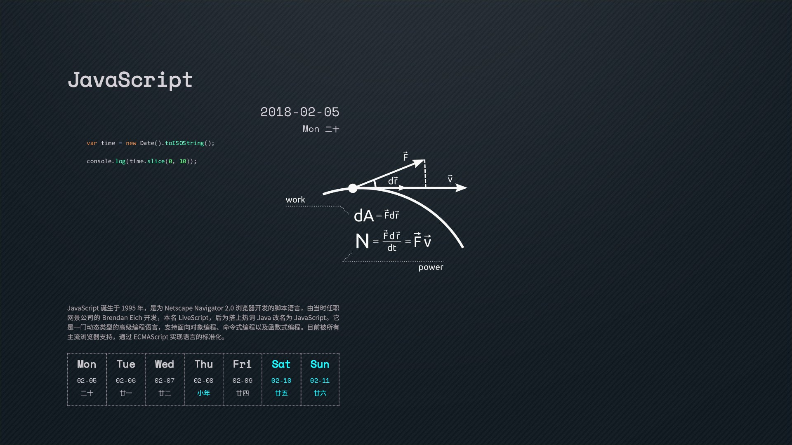

# 2018编程日历壁纸Mac OS

今天看见了[ttttmr](https://github.com/ttttmr/2018_code_calendar_wallpaper/commits?author=ttttmr)的[2018编程日历壁纸](https://github.com/ttttmr/2018_code_calendar_wallpaper)，无奈人家是Windows的，于是自己写了一个Mac OS一键换编程日历壁纸的python脚本。

### 效果图：



### 一键换壁纸动图展示


### 依赖

- Python3 
- ImgaeMaick
- Ghostscript `brew install ghostscript`即可

### 使用:
下载项目，进入项目地址，然后`python wallpaper.py`即可实现一键换壁纸，如果你想使用自己的壁纸，可以将项目目录下的`paper.jpg`换成你的壁纸。

### 参考资源:

1. [ttttmr](https://github.com/ttttmr/2018_code_calendar_wallpaper/commits?author=ttttmr)的[2018编程日历壁纸](https://github.com/ttttmr/2018_code_calendar_wallpaper)
2. [极客编程日历2018桌面壁纸
](https://www.jianshu.com/p/912ce01d4752)

### 采坑经历:

- 在使用上述参考资源2中的脚本时，经历了一些坑，首先是ImageMaick的安装问题，运行脚本时，提示需要安装ImageMaick，`brew install ImageMaick`后运行依然无效，最终解决办法为[https://stackoverflow.com/questions/24803747/how-to-use-or-install-magickwand-on-mac-os-x](https://stackoverflow.com/questions/24803747/how-to-use-or-install-magickwand-on-mac-os-x)

```
$ brew uninstall --force imagemagick

$ brew install imagemagick@6

$ echo 'export PATH="/usr/local/opt/imagemagick@6/bin:$PATH"' >> ~/.bash_profile

$ brew link imagemagick@6 --force
```
-  在"一键换壁纸"，一直不知道Mac OS除了在系统设置中换壁纸外其他的方法，后来找到了一篇文章[Shell系列 - Mac OS X自动下载切换桌面壁纸](http://blog.csdn.net/rywaqpf/article/details/50404577)，于是照猫画虎，在python中使用了`os.system("osascript -e \"tell application \\\"Finder\\\" to set desktop picture to POSIX file \\\"/Users/apple/Desktop/Wallpaper/" + OUTPUT + "\\\"\"")`以实现“一键换壁纸”的效果。但"一键换壁纸"的命令中壁纸的地址必须使用绝对路径，所以还得通过`os.getced()`获取当前路径，所以最后的代码为：

```python
address = os.getcwd() + "/" + OUTPUT 
os.system("osascript -e \"tell application \\\"Finder\\\" to set desktop picture to POSIX file \\\"" + address + "\\\"\"")
```

- 由于壁纸的大小不同，可能会导致脚本运行后得到的日历壁纸在屏幕显示中不太正常，如有需要可以自己更改脚本中的参数:
`MARGIN_LEFT`,`MARGIN_TOP`以及`resolution`

- 当同一图片文件发生改变，再使用上述“一键换壁纸”命令时发现，壁纸并不会发生改变，为了使得每周使用者在使用该脚本时正常使用，特意改变输出文件的文件名为turing+本周周数。

